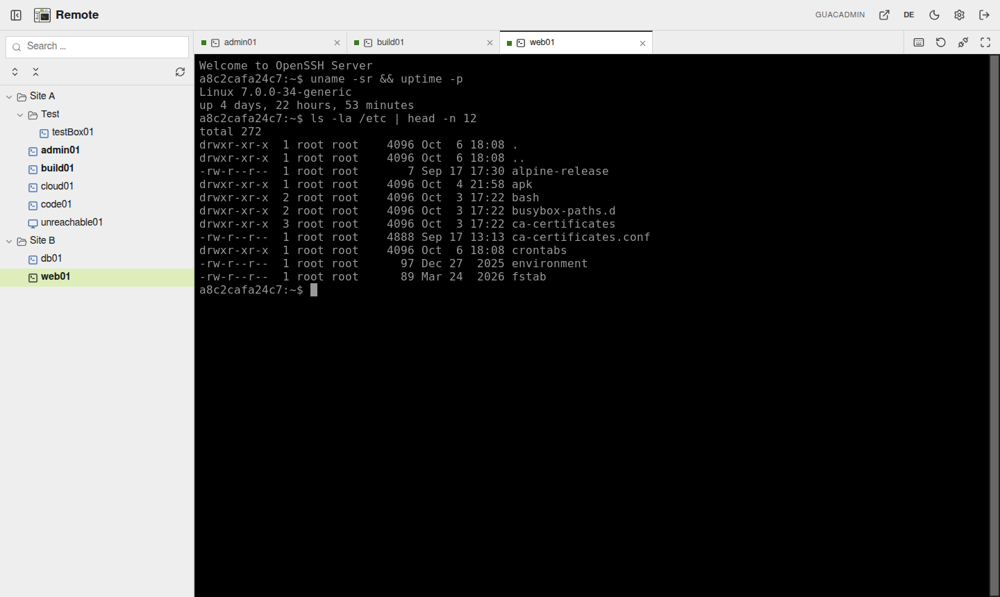

<p align="center">
  <picture>
    <source media="(prefers-color-scheme: dark)" srcset="docs/icon-dark.svg">
    
  </picture>
</p>

# guacamole-rdm

A Remote-Desktop-Manager-style front end for [Apache Guacamole](https://guacamole.apache.org/):
a connection **tree on the left**, the open sessions as **tabs on top**, all of them
live at the same time.

<picture>
  <source media="(prefers-color-scheme: dark)" srcset="docs/screenshot-dark.png">
  
</picture>

It is a pure static SPA (Svelte 5 + TypeScript) served by an unprivileged nginx.
It has no backend, no database and no user store of its own — everything comes
from the Guacamole installation it is placed next to:

| Concern | Where it lives |
| --- | --- |
| Login (SSO / local) | Guacamole's auth extensions; the SPA reuses Guacamole's token |
| Connections, folders, permissions | Guacamole (managed in its own UI) |
| RDP / VNC / SSH | guacd, through Guacamole's WebSocket tunnel |
| Client library | `guacamole-common-js`, loaded **from the Guacamole server** at runtime, so it always matches the server version |

## Quick start

[`examples/docker-compose.yml`](examples/docker-compose.yml) is a complete,
hardened stack — Guacamole, guacd, PostgreSQL, this image and a Traefik in
front — to try it on your machine:

```bash
cd examples
cp .env.example .env        # set POSTGRES_PASSWORD
docker compose up -d --wait
```

Then open http://localhost:8080/ (tree + tabs) and log in as `guacadmin` /
`guacadmin`. Change that password right away in Guacamole's own UI at
http://localhost:8080/guacamole/, and create your connections there; folders
are Guacamole *connection groups*.

## Features

- Folder tree from Guacamole's connection groups; search, keyboard navigation
  (arrows, Enter, Ctrl+Enter for a second session), expand state remembered.
- Tabs: double-click opens (or focuses) a session, middle-click / context menu
  opens a second one; drag to reorder; close, close others, reconnect.
- Every tab keeps its connection while in the background; switching is instant.
- Display follows the window size (dynamic resize where the protocol supports
  it), HiDPI-aware; fullscreen; Ctrl+Alt+Del; clipboard both ways (where the
  browser allows clipboard access).
- Light/dark theme; the look is a replaceable `theme.css`.
- German and English UI (`src/lib/i18n/`), switchable at runtime without
  dropping open sessions.

## Deployment

The SPA must run on the **same origin** as Guacamole: it shares Guacamole's login
token (`localStorage["GUAC_AUTH_TOKEN"]`) and calls its API and tunnels without
CORS. The SPA takes the root of the host; Guacamole keeps its default context
`/guacamole/` for its own UI, administration, API and tunnels. Both sit behind
one reverse proxy: `/guacamole` goes to Guacamole, everything else to this
image. `deploy/docker-compose.test.yml` is a complete, hardened example
(Guacamole + guacd + PostgreSQL + this image) including the Traefik labels.

If Guacamole lives somewhere else on the same origin, point
`RDM_GUACAMOLE_URL` there.

### Image

`ghcr.io/datacore/guacamole-rdm`, built by GitHub Actions
(`.github/workflows/ci.yml`) for `linux/amd64` and `linux/arm64`: a tag
`vX.Y.Z` → `:X.Y.Z` and `:X.Y`, `main` → `:latest` and `:sha-<commit>`.

Pin a version tag in production, never `latest`.

Runs as uid 101, read-only root filesystem, no capabilities; needs a tmpfs on
`/tmp`. Port 8080, health endpoint `/healthz`.

| Variable | Default | Meaning |
| --- | --- | --- |
| `RDM_TITLE` | `Remote` | Header and browser tab title |
| `RDM_GUACAMOLE_URL` | `/guacamole/` | Path of the Guacamole web app on this origin (Guacamole's default context) |
| `RDM_AUTO_SSO` | `true` | Go straight to the identity provider when Guacamole offers SSO |
| `RDM_LANGUAGE` | `auto` | UI language: `de`, `en`, or `auto` (browser preference, else English). Users can switch in the header; their choice is remembered per browser |
| `RDM_THEME` | `default` | Theme directory under `themes/`: the built-in `default`, or your own mounted one (see below) |

### SSO (OpenID Connect)

Guacamole's OIDC extension uses the implicit flow and generates the nonce on the
server. The SPA asks Guacamole for the authorization URL, replaces only
`redirect_uri` with its own URL and posts the returned `id_token` back to
Guacamole. So the Keycloak client needs **two valid redirect URIs**:

```
https://<host>/             (this app)
https://<host>/guacamole/   (Guacamole's own UI, its OPENID_REDIRECT_URI)
```

Break-glass: `https://<host>/?local` shows the username/password form even
when SSO would take over.

### Theming

The image ships one theme, `default`: close to Guacamole's own UI (charcoal
buttons, pale-green selection, system fonts), with a light and a dark variant.
The user switches in the header; the OS preference is the default.

A theme is a directory `themes/<name>/` with `theme.css`, `logo.svg` and
`logo-dark.svg`, plus whatever it references (fonts, images) by relative URL.
The app styles itself only through the `--g-*` custom properties;
`public/themes/default/theme.css` documents the contract. Every theme needs a
light and a dark variant. To use your own, mount it and select it:

```yaml
  rdm:
    environment:
      - RDM_THEME=corporate
    volumes:
      - ./themes/corporate:/usr/share/nginx/html/themes/corporate:ro
```

Fonts belong in the theme directory and are loaded with `@font-face` from
`theme.css`; the CSP only allows this origin. The container refuses to start
if the selected theme is missing.

## Security

- **No secrets, no state** in the image: auth, connections and permissions stay
  in Guacamole. The SPA holds only Guacamole's session token, in the same
  `localStorage` key Guacamole's own UI uses.
- **CSP** `default-src 'self'` without `unsafe-inline`/`unsafe-eval`, no
  external resources, `frame-ancestors
  'none'`. This is the main defence for the token in `localStorage`.
- **Same origin enforced:** a `RDM_GUACAMOLE_URL` on another origin is refused;
  `RDM_THEME` and `RDM_LANGUAGE` are validated, the container does not start
  with bad values.
- **SSO:** the nonce is generated and checked by Guacamole; the SPA only swaps
  `redirect_uri`, which the identity provider checks against its allow list,
  and binds the request to the browser tab with its own `state` — an
  `id_token` without it is refused.
- **Brute-force ban friendly:** remembered tokens are checked with
  `HEAD api/session`, which Guacamole does not count as a login attempt.
- **Second factor:** Guacamole's TOTP extension works, enrollment included.
- **Runtime:** nginx as uid 101, read-only root fs, `cap_drop: ALL`,
  `no-new-privileges`, memory/pid limits, base images pinned to a version.
- **Pipeline:** `npm audit` (runtime deps) and a Trivy scan of the built image
  (fixable HIGH/CRITICAL fail the build) before anything is deployed.
- **Exposure:** meant to sit behind an IP allow list (`internalOnly`) like the
  Guacamole it fronts; it adds no endpoint Guacamole does not already have.

## Development

```bash
npm ci
docker compose -f deploy/dev/docker-compose.yml up -d --wait   # Guacamole + SSH target
sh deploy/dev/seed.sh                                         # demo tree
npm run dev                                            # http://127.0.0.1:5173/
```

Login `guacadmin` / `guacadmin`. Vite proxies `/guacamole/` to the dev
Guacamole on `127.0.0.1:18080`, the same layout as in production.

Checks (also run in CI): `npm run check` (types, warnings are errors) and
`npm test` (unit tests).

## License

MIT, see `LICENSE`. Apache Guacamole and `guacamole-common-js` (loaded at runtime
from your Guacamole server) are Apache-2.0. The icons are Lucide (ISC).

## How it was built

This project was developed with [Claude Code](https://claude.com/claude-code),
Anthropic's agentic coding tool, and reviewed and tested by the maintainers.
